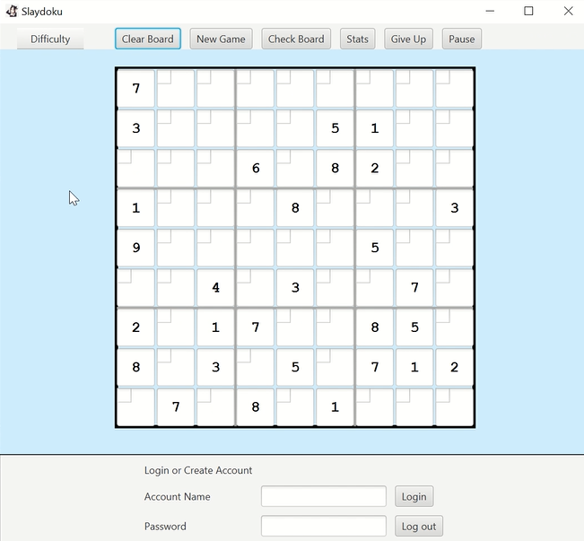

# Salydoku Game

<div align="center">  
  
</div>


## Authors: 
- **Jenny Yu**
- Josh Samadder
- Ricky Su
- Chia-En Chang

*April 2023*

---

## Table of Contents
- [Overview](#overview)
- [Gameplay Features](#gameplay-features)
- [Technical Features](#technical-features)
- [How to run](#how-to-run-the-program)
- [Object-Oriented Principles](#object-oriented-principles)

---

## Overview
[Back to top](#table-of-contents)

Salydoku is a Sudoku game built in Java with a JavaFX GUI. <br> 
Players can select from easy, medium, or hard difficulty levels and track their progress with a built-in timer. <br> 
The game also includes a login system where users can save their best times, view their game history, and track wins and losses! 

See the [video](https://github.com/JennyYu2/Projects/raw/main/Slaydoku/SlaydouDemoVid.mp4) in this repo for a demo of the functionalities!

---

## Gameplay Features
[Back to top](#table-of-contents)

- Play on a 9x9 Sudoku grid
- A simple animation plays when the game is first launched
- Choose from easy, medium, or hard difficulty levels
- **Clear Board** button clears all user input on the current board
- **New Game** button starts a new game
- **Check Board** button validates the user's inputs on the board. Incorrect inputs will be highlighted in red
- **Stats** button allows logged in users to see their stats:
  - Best time
  - Games Played
  - Games won
- **Give Up** button autocompletes the current board
- Built-in timer to track completion time
- **Pause** button will pause the timer
- Cute GIF plays when a user successfully completes a game
- Users can log into an existing account or as a new user

---

## Technical Features
[Back to top](#table-of-contents)

- Built using Java and JavaFX
- Recursively generates new Sudoku boards
- Number of blank spaces correlates to difficulty level
- Uses Java's `Serializable` interface to store user login information and user stats
- Implements a clear separation between game logic, user interface, and data management.
- Validates Sudoku boards through backtracking algorithms
- Incorporates exception handling for invalid inputs and file I/O
- GUI designed with event-driven programming (button clicks, timer updates, etc.)
  
---

## How to Run the Program
[Back to top](#table-of-contents)

0. Prerequisites
   - Must have Java 8 or later installed
   - JavaFX installed and added to your classpath
     
1. Clone this repository or download all the files
2. Navigate to the project folder and compile the program:
```
javac *.java
```
3. Run the program:
```
java SudokuGUI
```
4. A game window will pop up and you can start playing!

---

## Object-Oriented Principles
[Back to top](#table-of-contents)

- Model-View-Controller (MVC) design pattern
- Observer design pattern
- Encapsulation of game logic, board state, and user data
- Inheritance for shared GUI components and behaviors
- Polymorphism in puzzle generation and difficulty settings


